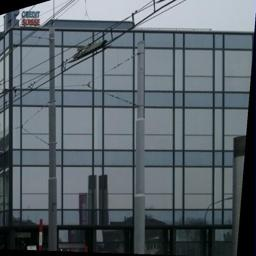
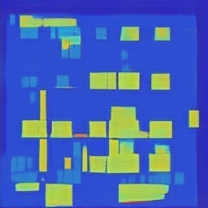
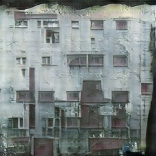
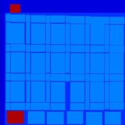
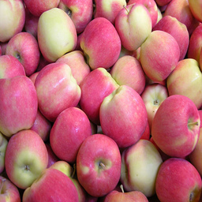
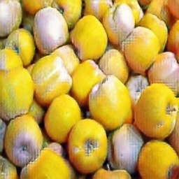
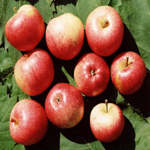
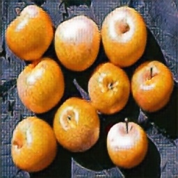
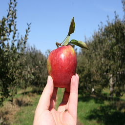
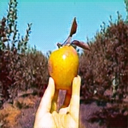

# CycleGAN based on tensorflow

## Prerequisites
- python 3.5
- tensorflow-gpu 1.4.0
- numpy 1.14.2
- scipy 1.0.0

## Datasets
Download the datasets using the following script:
```bash
$ ./download_dataset.sh facades
```

- `facades`: 400 images from the [CMP Facades dataset](http://cmp.felk.cvut.cz/~tylecr1/facade/).
- `cityscapes`: 2975 images from the [Cityscapes training set](https://www.cityscapes-dataset.com/).
- `maps`: 1096 training images scraped from Google Maps.
- `horse2zebra`: 939 horse images and 1177 zebra images downloaded from [ImageNet](http://www.image-net.org/) using keywords `wild horse` and `zebra`.
- `apple2orange`: 996 apple images and 1020 orange images downloaded from [ImageNet](http://www.image-net.org/) using keywords `apple` and `navel orange`.
- `summer2winter_yosemite`: 1273 summer Yosemite images and 854 winter Yosemite images were downloaded using Flickr API. See more details in our paper.
- `monet2photo`, `vangogh2photo`, `ukiyoe2photo`, `cezanne2photo`: The art images were downloaded from [Wikiart](https://www.wikiart.org/). The real photos are downloaded from Flickr using combination of tags *landscape* and *landscapephotography*. The training set size of each class is Monet:1074, Cezanne:584, Van Gogh:401, Ukiyo-e:1433, Photographs:6853.
- `iphone2dslr_flower`: both classe of images were downlaoded from Flickr. The training set size of each class is iPhone:1813, DSLR:3316. See more details in our paper.

## Results
### facades X-> Y

| RealX | fakeY | | fakeY | GenerateX | | RealY |
|-------|--------|-|-------|--------|-|-------|
| | | | | | | |
### apple to orange

| apple | G_orange | | apple | G_orange | | apple | G_orange |
|-------|--------|-|-------|--------|-|-------|--------|
| | | | | | | | |

## Training

```bash
$ python3 train.py
```

If you need help
```bash
$ python3 train.py -h
```

If you want to continue training from the point you halted before, then  set 'load_model' parameter.
```bash
$ python3 train.py --load_model path_of_your_model
```

## Export model
you can export model for inference
```bash
$ python3 export_graph.py --checkpoint_dir path_of_your_checkpoint --XtoY_model facadesX2Y.pb --YtoX_model facedesY2X.pb --image_size 256
```

## Inference

For example:
```bash
$ python3 inference.py --model pretrained/your_model.pb --input input.jpg --output output.jpg --image_size 256
```
## Pretrained models
pretrained models of facades: https://github.com/jijeng/CycleGAN/releases

## License
This project is licensed under the MIT License - see the [LICENSE](LICENSE) file for details.

## Reference
- The torch implementation of CycleGAN, https://github.com/junyanz/CycleGAN
- the tensorflow implementation of CycleGAN, https://github.com/vanhuyz/CycleGAN-TensorFlow
- original paper : https://arxiv.org/abs/1703.10593
